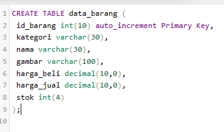
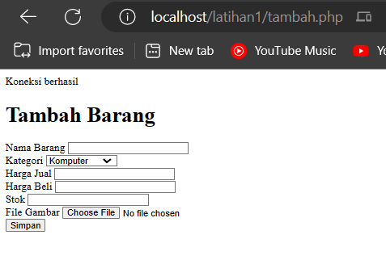

# Latihan-Praktikum-3

## Nama   : Imam Solehudin
## Nim    : 312110290
## Kelas  : TI.21.C.1
Markul    : Pemrograman Web 2


1. Membuat database

2. Membuat Tabel database

Program :
```php
CREATE TABLE data_barang (
 id_barang int(10) auto_increment Primary Key,
 kategori varchar(30),
 nama varchar(30),
 gambar varchar(100),
 harga_beli decimal(10,0),
 harga_jual decimal(10,0),
 stok int(4)
);
```



3. Menambahkan Data di MySQL


```php
<?php
error_reporting(E_ALL);
include_once 'koneksi.php';
if (isset($_POST['submit']))
{
    $nama = $_POST['nama'];
    $kategori = $_POST['kategori'];
    $harga_jual = $_POST['harga_jual'];
    $harga_beli = $_POST['harga_beli'];
    $stok = $_POST['stok'];
    $file_gambar = $_FILES['file_gambar'];
    $gambar = null;
    if ($file_gambar['error'] == 0)
    {
        $filename = str_replace(' ', '_',$file_gambar['name']);
        $destination = dirname(__FILE__) .'/gambar/' . $filename;
        if(move_uploaded_file($file_gambar['tmp_name'], $destination))
        {
            $gambar = 'gambar/' . $filename;;
        }
        $sql = 'INSERT INTO data_barang (nama, kategori,harga_jual, harga_beli, stok, gambar) ';
        $sql .= "VALUE ('{$nama}', '{$kategori}','{$harga_jual}','{$harga_beli}', '{$stok}', '{$gambar}')";
        $result = mysqli_query($conn, $sql);
        header('location: index.php');
    }

}

?>
<!DOCTYPE html>
<html lang="en">
<head>
    <meta charset="UTF-8">
    <link href="style.css" rel="stylesheet" type="text/css" />
    <title>Tambah Barang</title>
</head>
<body>
<div class="container">
    <h1>Tambah Barang</h1>
    <div class="main">
        <form method="post" action="tambah.php" enctype="multipart/formdata">
            <div class="input">
                <label>Nama Barang</label>
                <input type="text" name="nama" />
            </div>
            <div class="input">
            <label>Kategori</label>
                <select name="kategori">
                    <option value="Komputer">Komputer</option>
                    <option value="Elektronik">Elektronik</option>
                    <option value="Hand Phone">Hand Phone</option>
                </select>
            </div>
            <div class="input">
                <label>Harga Jual</label>
                <input type="text" name="harga_jual" />
            </div>
            <div class="input">
                <label>Harga Beli</label>
                <input type="text" name="harga_beli" />
            </div>
            <div class="input">
                <label>Stok</label>
                <input type="text" name="stok" />
            </div>
            <div class="input">
                <label>File Gambar</label>
                <input type="file" name="file_gambar" />
            </div>
                <div class="submit">
                <input type="submit" name="submit" value="Simpan" />
            </div>
            </form>
            </div>
        </div>
</body>
</html>

```


4. Mengubah data 

Untuk mengubah data, pada saat mengakses linknya kita tambahkan ?id=(no_id). Contoh : localhost/latihan1/hapus.php?id=1 .
Maka kita akan diarahkan untuk mengubah data id nomor 1.

```php

<?php
error_reporting(E_ALL);
include_once 'koneksi.php';
if (isset($_POST['submit']))
{
    $id = $_POST['id'];
    $nama = $_POST['nama'];
    $kategori = $_POST['kategori'];
    $harga_jual = $_POST['harga_jual'];
    $harga_beli = $_POST['harga_beli'];
    $stok = $_POST['stok'];
    $file_gambar = $_FILES['file_gambar'];
    $gambar = null;

    if ($file_gambar['error'] == 0)
    {
        $filename = str_replace(' ', '_', $file_gambar['name']);
        $destination = dirname(__FILE__) . '/gambar/' . $filename;
        if (move_uploaded_file($file_gambar['tmp_name'], $destination))
        {
        $gambar = 'gambar/' . $filename;;
        }
    }
    $sql = 'UPDATE data_barang SET ';
    $sql .= "nama = '{$nama}', kategori = '{$kategori}', ";
    $sql .= "harga_jual = '{$harga_jual}', harga_beli = '{$harga_beli}',
    stok = '{$stok}' ";
    if (!empty($gambar))
    $sql .= ", gambar = '{$gambar}' ";
    $sql .= "WHERE id_barang = '{$id}'";
    $result = mysqli_query($conn, $sql);
    header('location: index.php');
}
$id = $_GET['id'];
$sql = "SELECT * FROM data_barang WHERE id_barang = '{$id}'";
$result = mysqli_query($conn, $sql);
if (!$result) die('Error: Data tidak tersedia');
$data = mysqli_fetch_array($result);
function is_select($var, $val) {
    if ($var == $val) return 'selected="selected"';
    return false;
}
?>
<!DOCTYPE html>
<html lang="en">
<head>
    <meta charset="UTF-8">
    <link href="style.css" rel="stylesheet" type="text/css" />
    <title>Ubah Barang</title>
</head>
<body>
<div class="container">
    <h1>Ubah Barang</h1>
    <div class="main">
        <form method="post" action="ubah.php" enctype="multipart/formdata">
            <div class="input">
                <label>Nama Barang</label>
                <input type="text" name="nama" value="<?php echo $data['nama'];?>" />
            </div>
            <div class="input">
            <label>Kategori</label>
            <select name="kategori">
            <option <?php echo is_select
('Komputer', $data['kategori']);?> value="Komputer">Komputer</option>
 <option <?php echo is_select
('Komputer', $data['kategori']);?> value="Elektronik">Elektronik</option>
 <option <?php echo is_select
('Komputer', $data['kategori']);?> value="Hand Phone">Hand Phone</option>
            </select>
            </div>
 <div class="input">
 <label>Harga Jual</label>
 <input type="text" name="harga_jual" value="<?php echo
$data['harga_jual'];?>" />
 </div>
 <div class="input">
 <label>Harga Beli</label>
 <input type="text" name="harga_beli" value="<?php echo
$data['harga_beli'];?>" />
 </div>
 <div class="input">
 <label>Stok</label>
 <input type="text" name="stok" value="<?php echo
$data['stok'];?>" />
 </div>
 <div class="input">
 <label>File Gambar</label>
 <input type="file" name="file_gambar" />
 </div>
 <div class="submit">
 <input type="hidden" name="id" value="<?php echo
$data['id_barang'];?>" />
 <input type="submit" name="submit" value="Simpan" />
 </div>
 </form>
 </div>
</div>
</body>
</html>

```
- Gambar 


5. Hapus Data

```php

<?php
include_once 'koneksi.php';
$id = $_GET['id'];
$sql = "DELETE FROM data_barang WHERE id_barang = '{$id}'";
$result = mysqli_query($conn, $sql);
header('location: index.php');
?>


```

Untuk menghapus data, pada saat mengakses linknya kita tambahkan ?id=(no_id). Contoh : localhost/latihan1/hapus.php?id=1 .
Maka secara otomatis id nomor 1 akan terhapus.
